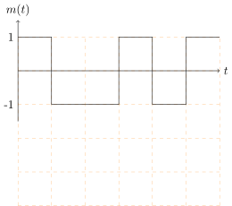
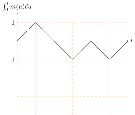

---

<!-- _header:  -->

# UESTC 3018 - Communication Systems and Principles

Lecture 12 — Angle Modulation in the Frequency Domain

Dr Hasan Abbas
[Hasan.abbas@glasgow.ac.uk](Hasan.Abbas@glasgow.ac.uk)
<!-- transition: fade -->
<!--  -->

---

# Somewhere (just) Familiar ... 

---

# From Last Time ⌛

- Angle Modulation is a non-linear process
- We don't change the amplitude
- In PM, we vary the phase $\theta(t)$ **linearly** with $m(t)$
- In FM, we vary the frequency $\omega(t)$ **linearly** with $m(t)$,
- PM and FM are very similar - a $90 \degree$ phase-shift
  

---

# This Lecture 📆

- Bandwidth in FM
- Carson's Rule
- Spectral Analysis

---

# Down the History Lane 📜

- Due to inherent non-linearity, FM is hard to analyse
- Can't really apply Fourier transform tools
- Motivation was to reduce the bandwidth
- Turns out FM has infinite theoretical bandwidth

---

# The Historical Irony: The "Bandwidth Fallacy" 🤯

### FM was originally designed to SAVE space

- **The 1920s Goal:** AM radios were crowded. Engineers wanted a "Narrowband" system to squeeze more stations onto the dial.
- **The Intuition:** "If I only wiggle the frequency by $\pm 50$ Hz, surely the bandwidth is tiny!"
- **The Mathematical Reality:**
  - In 1922, mathematician **John Carson** proved that FM actually generates **infinite sidebands**.
  - He famously declared FM "a nuisance" and static.
- **The Pivot:** Edwin Armstrong realised the "failure" was a "feature."
  - *New Idea:* "Stop trying to save bandwidth. Let's **waste** bandwidth to destroy noise!"

---

# Recall from the Previous Lecture ... 

- In FM, we vary the frequency $\omega_i(t)$ **linearly** with $m(t)$,

$$
\omega_i^{FM}(t) = \omega_c +k_f m(t)
$$

- The phase $\theta^{FM}$ is,

$$
\theta^{FM}(t) = \int_{-\infty}^{t} \omega_i^{FM}(u) du = \omega_c t + k_f \int_{-\infty}^{t} m(u) du
$$

---

# First an Example - FSK

- Idea is to send a string of bits as two different frequencies
- Commonly used in digital radio, electronics and modems

---

# What about PM?

- What if we integrated the waveform?
- Essentially achieving the same waveform through phase modulator
- Input is now $\int_{0}^{t} m(u) du$

---

# <!--fit-->  Bandwidth Analysis ♾️ 

---

# Analysing Bandwidth

- To simplify the expression, $a(t)=\int_{-\infty}^{t}m(u)\,d u$
- Let's define, 
$$
\hat{\varphi}^{\mathrm{FM}}(t)=A\,e^{j[\omega_{c}t+k_{f}a(t)]}=A e^{j k_{f}a(t)}e^{j\omega_{c}t}
$$
from where,
$$
\varphi^{\mathrm{FM}} (t) = \Re \left[\hat{\varphi}^{\mathrm{FM}}(t) \right].
$$
- Expanding the complex exponential through the Maclaurin power series,
$$
\hat{\varphi}^{\mathrm{FM}}(t) = A \left[ 1 + jk_f a(t) - \frac{k_f^2}{2!}a^2(t) + \dots + j^n \frac{k_f^n}{n!}a^n(t)\right] \times e^{j \omega_c t}
$$

---

# Some Observations

- If $m(t)$ or $M(\omega)$ has a bandwidth of B
- Then $a(t)$ also has a bandwidth of $B$ Hz (integration is a linear operator).
- The $n^{th}$ term, $\frac{k_f^n}{n!}a^n(t)$ will have a bandwidth of $n \times B$
- This is due to convolution principle, i.e.
- $A(\omega) * A(\omega)$ spreads the Fourier transform to $2B$
- Essentially, we have **infinite bandwidth**
- But...
- $\frac{k_f^n}{n!}a^n(t) \to 0$, meaning we only care about the first few terms.

---

# FM Signal Representation

- Using the $\varphi^{\mathrm{FM}} (t) = \Re \left[\hat{\varphi}^{\mathrm{FM}}(t) \right]$ representaion, we get,

$$
\begin{aligned}
\varphi^{\mathrm{FM}} (t) &= \Re  \left\{A \left[ 1 + jk_f a(t) - \frac{k_f^2}{2!}a^2(t) + \dots + j^n \frac{k_f^n}{n!}a^n(t)\right] \times \left[\cos (2 \pi f_c t) + j \sin (2 \pi f_c t) \right] \right\} \\
&= A \left( \cos (2 \pi f_c t)  - k_f a(t) \sin (2 \pi f_c t) - \frac{k_f^2}{2!}a^2(t) \cos (2 \pi f_c t) + \dots \right) \\
&\approx A \left( \cos (2 \pi f_c t)  - k_f a(t) \sin (2 \pi f_c t) \right)
\end{aligned}
$$

- This is a narrowband FM signal representation
- The approximation is good when $\left| k_f a(t) \right| \ll 1$
- Generally, we consider 2B bandwidth as narrowband
- PM has a similar expression

---

# Playing with the tones

---

# Playing with the tones

---

# Playing with the tones

---

# A Dilemma 😵‍💫

- To make the best of FM (or PM), we need make the frequency deviation large enough
- Need to choose a large enough $k_f$ to break the $\left| k_f a(t) \right| \ll 1$ condition
- This is the **wideband** FM case
- ⚠️ We can't ignore the higher order terms in the power series anymore
- We need to rely on empirical formulas to estimate the bandwidth

---

# Wideband FM

- **Context** We need frequency deviation for the FM signal to be meaningful
- But what is the bandwidth of an FM signal?
- *Answer* We use empirical methods / estimations 

--- 

# An Example

- For an FM signal $m(t)$, the max and min centre frequencies are $\omega_c + k_f m_p$ and $\omega_c - k_f m_p$ respectively
- Taking into account the bandwidth of the sinc lobe ($4 \pi B$)
- Total Bandwidth is the difference

---

# Carson's Rule 🔑

- The estimated bandwidth is,

$$
B^{\mathrm{FM}} = \frac{1}{2 \pi} \left( 2 k_f m_p + 8 \pi B \right)
$$

- The frequency deviation $\Delta f$ is given by,
$$
\Delta f = k_f \frac{m_{\mathrm{max}} - m_{\mathrm{min}}}{2 \times 2 \pi} \, \mathrm{Hz}
$$

- The estimated bandwidth (Hz) is,

$$
B^{\mathrm{FM}} \approx 2 (\Delta f + 2B)
$$

---

# Carson's Rule - Narrowband Formula

- Remember for narrowband FM, $\left| k_f a(t) \right| \ll 1$
- $\Delta f$ is also very small

$$
B^{\mathrm{FM}} \approx 4B
$$

- Earlier we analysed that for narrowband, the bandwidth is 2B Hz.
- A better estimate is then,
$$
B^{\mathrm{FM}} = 2 \left( \Delta f +B\right) = 2 \left( \frac{k_f m_p}{2 \pi} + B \right) 
$$

- A commonly used expression is in terms of deviation ratio,

$$
B^{\mathrm{FM}} = 2B (\beta + 1)
$$

where $\beta$ is the deviation ratio $\Delta f/B$

---

# Further Reading 

- Section 4.6 - Bandwidth Analysis of Angle Modulations 
Modern Digital and Analog Communication Systems, $5^{th}$ Edition
- B P Lathi and Zhi Ding

---

# <!--fit-->  FM: Where the sound is always sweeter! 📻 

---

# Get in touch

Hasan.Abbas@glasgow.ac.uk 