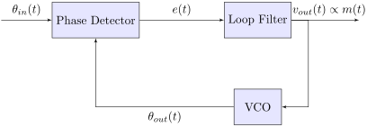

---

<!-- _header:  -->

# UESTC 3018 - Communication Systems and Principles

Lecture 13 — Frequency Modulation Detection

Dr Hasan Abbas
[Hasan.abbas@glasgow.ac.uk](Hasan.Abbas@glasgow.ac.uk)
<!-- transition: fade -->
<!--  -->

<!-- This is presenter note. You can write down notes through HTML comment. -->

---

# From Last Time ⌛

- Angle Modulation Bandwidth Dilemma
- Narrowband $\left| k_f a(t) \right| \ll 1$ FM has bandwidth of $2B$
- For Wideband FM, we use the Carson's rule
- We improved the formula to:

$$
B^{\mathrm{FM}} = 2B (\beta + 1)
$$

where $\beta$ is the deviation ratio $\Delta f/B$

---

# We should know ...

- Constancy of Power in FM/PM signals
- Nonlinearity of FM/PM modulation
- Irregularity of Zero Crossings
- Difficult to Visualise Message Waveform
- Increase Transmission Bandwidth

---

# Today's Lecture 📆

- FM using simplest message signal
- FM Demodulation Techniques

---

# Guess the 🟡, 🔴 and 🟢 signals

---

# FM with a Tone

- Due to inherent non-linearity, FM is hard to analyse
- Lets start off with a tone i.e., a sinusoidal signal, $m(t) = \cos (2 \pi f_m t)$

$$
a(t) = \int_{-\infty}^{t} m(u) du = \frac{1}{2 \pi f_m} \sin (2 \pi f_m t)
$$
- From last time,
$$
\hat{\varphi}^{\mathrm{FM}}(t)=A\,e^{j[\omega_{c}t+k_{f}a(t)]}=A e^{j k_{f}a(t)}e^{j\omega_{c}t}
$$
$$
\hat{\varphi}^{\mathrm{FM}}(t) = A \,e^{j[\omega_{c}t+\frac{k_f}{2 \pi f_m} \sin (2 \pi f_m t)]}= A e^{j \left(\omega_{c}t + \beta\sin (2\pi f_m t)\right)}
$$
- Here we assume $a(-\infty) = 0$ (causality)
- For tone only, $B = f_m$
- Frequency deviation ratio $\beta$ = Modulation index

---

# Remember the Fourier Series 🌊

Any periodic signal $E(t)$ can be written as a sum of complex exponentials:
$$E(t) = \sum_{n=-\infty}^{\infty} c_n e^{j n \omega_m t}$$

To find the coefficients $c_n$, we use the Fourier Analysis integral over one period ($T = 2\pi$ in angle):

$$c_n = \frac{1}{2\pi} \int_{-\pi}^{\pi} E(x) e^{-j n x} dx$$

Substituting our envelope $E(x) = e^{j \beta \sin x}$:
$$c_n = \frac{1}{2\pi} \int_{-\pi}^{\pi} e^{j(\beta \sin x - n x)} dx$$

--

# FM with a Tone (contd.) - The Bessel Function

- $e^{j \beta \sin(2\pi f_m t)}$ is a periodic function with frequency $f_m$
- We can have a Fourier series representation,
  $$
  e^{j \beta \sin(2\pi f_m t)} = \sum_n c_n (\beta) e^{2 n \pi j f_m t}
  $$
- The complex Fourier coefficient  
$$
c_n = f_m \int_{-1/{2f_m}}^{1/{2f_m}} e^{j \beta \sin(2\pi f_m t)} e^{-2 n \pi j f_m t} dt
$$

---

# The Bessel Function

- Defining a new substitute variable, $x =2 \pi f_m t$
$$
c_n = \frac{1}{2 \pi} \int_{-\pi}^{\pi} e^{j \beta \sin x  - n j x} dx = J_n(\beta)
$$

- It is the exact mathematical definition of the **Bessel Function of the First Kind ($J_n$)**.
- $\beta$ is the deviation ratio (as well as modulation index)

---

# Playing with the tones

---

# From yesterday ... Playing with the tones

---

# Playing with the tones

---

# Required Number of Harmonics ($N$)

| Power (%) |  $\beta = 0.5$  | $\beta = 1$ | $\beta = 2$ | $\beta = 5$ | $\beta = 10$ | $\beta = 15$ |
| :-------: | :---: | :---------: | :---------: | :---------: | :----------: | :----------: |
|  **80**   |   —   |      1      |      2      |      4      |      7       |      14      |
|  **90**   |   1   |      2      |      5      |      8      |      10      |      15      |
|  **98**   |   1   |      3      |      6      |      9      |      11      |      16      |

---

# <!--fit-->  From Message to Signal 

---

# A Journey ... that takes work!

<!-- Import Hanzi Writer HTML Stuff -->

  

  “
  

  ”
  

  “
  

  ”

---

# The Demodulation Challenge 🧩

- In AM, the message $m(t)$ was sitting right there on the amplitude envelope. We just used a diode to "grab" it.

- In FM, the message is buried inside the phase integral:
$$\varphi^{\mathrm{FM}}(t) = A_c \cos \left(\omega_c t + k_f \int_{-\infty}^{t} m(u) du \right)$$ 

- We need a system where the Output Voltage is proportional to the Instantaneous Frequency.
$$V_{out}(t) \propto \omega_i(t) \propto m(t)$$

---

# FM Demodulation

- Recall, the instantaneous frequency changes with signal amplitude, 
$$\omega_i^{FM}(t) = \omega_c +k_f m(t)$$
- We need a system where output is proportional to the input.
- Need to convert frequency variations into amplitude variations
- Then use envelope detection.

---

# Demodulation Strategy: Slope Detection 📉

- A system where the Output Voltage is proportional to the Input Frequency.
$$V_{out} \propto \omega_{in}$$

- If we differentiate a sinusoid $\sin(\omega t)$, the frequency $\omega$ pops out as a multiplier:
$$\frac{d}{dt} [A \sin(\omega t)] = A \cdot \omega \cdot \cos(\omega t)$$

But How? 🤔
1.  **Ideal Differentiator:** A circuit with transfer function $H(j\omega) = j\omega$ (e.g., a Capacitor).
2.  **FM to AM Conversion:** The frequency variations are now converted into *Amplitude* variations ($A \cdot \omega$).
3.  **Envelope Detection:** We can now use a simple AM Diode detector to recover $m(t)$.

---

# FM Demodulation (contd.)

$$
\begin{aligned}
\dot{\varphi}^{\mathrm{FM}}(t) & =\frac{d}{d t}\left\{A \cos \left[\omega_c t+k_f \int_{-\infty}^t m(\alpha) d \alpha\right]\right\} \\
& =A\left[\omega_c+k_f m(t)\right] \sin \left[\omega_c t+k_f \int_{-\infty}^t m(\alpha) d(\alpha)-\pi\right]
\end{aligned}
$$
- Note the signal $m(t)$ is present both in the envelope and frequency
- Because $\omega = k_f m_p < \omega_c$, we have $\omega_c + k_f m(t) > 0$
- We can simply perform envelope detection (as in AM).

---

# FM Demodulation

---

# A Simple RC Circuit

- A Simple RC high-pass circuit can be used to detect the slope
- The transfer function (voltage across the resistor) is
$$
H(\omega) = \frac{R}{R + \frac{1}{j\omega C}} = \frac{j\omega RC}{1 + j\omega RC} \approx j \omega RC
$$
- The approximation is true when $\omega_c RC \ll 1$
- We have a differentiator
- This is one of many possibilities (LC tank circuit being a better one)

---

# Superheterodyne Receivers

- Frequency Conversion or mixing is done to change the carrier frequency from $\omega_c$ to $\omega_{IF}$
- We call IF as intermediate frequency
$$
\begin{aligned}
x(t) &= 2 m(t) \cos \omega_c t \cos \omega_{mix} t \\
  &= m(t) \left[ \cos (\omega_c + \omega_{mix}) t + \cos (\omega_c - \omega_{mix}) t \right]
\end{aligned}
$$
- Setting $\omega_{mix} = \omega_c \pm \omega_{IF}$
$$
\begin{aligned}
x(t) &=  m(t) \left[ \cos \omega_{IF} t + \cos (2\omega_c \mp \omega_{IF}) t \right]
\end{aligned}
$$

<!-- Key Components and Their Functions:
RF Amplifier:

Amplifies the incoming RF signal to increase its strength before mixing.
Typically uses wideband amplification to accommodate a range of frequencies.
Must have low noise figure to minimize noise introduced by the receiver.
Local Oscillator:

Generates a sinusoidal signal at a frequency offset from the RF signal.
The frequency offset is chosen to produce the desired IF frequency.
Often uses a voltage-controlled oscillator (VCO) for tunability.
Mixer:

Multiplies the RF signal and the local oscillator signal.
Produces sum and difference frequencies.
Nonlinear device, typically a diode or transistor.
IF Amplifier:

Amplifies the IF signal.
Narrowband amplification is used to select the desired IF frequency and reject unwanted signals.
Provides most of the gain in the receiver.
IF Filter:

Filters the IF signal to remove noise and interference.
Typically a bandpass filter centered at the IF frequency.
Demodulator:

Extracts the original information-carrying signal from the IF signal.
The type of demodulator depends on the modulation scheme used (e.g., AM, FM, QAM). -->

---

# Superheterodyne Receivers

- Down converting to IF allows us to use sensitive amplifiers
- Bandpass filter is  very hard to design at RF
- Commonly used in many broadcast systems

---

# Phased-Locked Loop

- Slope detection is "Open Loop"—it just measures what comes in. 
- Modern systems use Feedback.
- A negative feedback system used in FM demodulation
- Instead of measuring the frequency, let's generate our own local frequency and try to keep it synchronised ("Locked").
- Compares the phase of the FM signal with the phase of a locally generated reference signal.
- First generate a VCO output $r(t)$  Phase Comparison 
- Check for errors with $e(t)$  Error Generated 
- $e(t)$ controls the VCO frequency  VCO function 
- VCO adjusts the frequency $x(t)$  Phase Lock 

- Objective is to minimise the phase difference between $x(t)$ and $y(t)$.

---

# The Control Loop Logic 🧠

1.  **Phase Detector:** Compares the Input angle $\theta_{in}$ vs the Local VCO angle $\theta_{out}$.
    $$e(t) = \theta_{in}(t) - \theta_{out}(t)$$
2.  **Loop Filter:** Averages the error to produce a control voltage $v_c(t)$.
3.  **VCO:** Adjusts its frequency based on $v_c(t)$.

If the loop is locked, $\omega_{out} = \omega_{in}$.
Since the VCO's frequency is set by $v_c(t)$, then the control voltage IS the demodulated message.

---

# Noise Performance: The "Triangle" 🔺

- Why do FM radio stations boost the Treble (high-pitch sound)?
- Demodulation involves differentiation (multiplying spectrum by $f$).
- White Noise (flat) $\times f$ = Ramped Noise.
- The Noise Power Spectral Density increases quadratically ($f^2$).
* Result: High frequencies (Treble) suffer from much worse SNR than Bass.

---

# The Solution: Pre-Emphasis & De-Emphasis 🎛️

- Rather than employing noise removal steps, we cheat the system.

1.  **Tx (Pre-emphasis):** We know the channel kills treble quality. So we artificially BOOST the treble (High Frequencies) by ~6dB/octave before transmitting.
    
2.  **Rx (De-emphasis):** We CUT the Treble at the receiver.

- This restores the original music balance.
- Crucially, it crushes the high-frequency triangle noise down to a flat floor.

<!-- --- -->
<!-- 
<!-- # fit  FM Generation 📡  -->
<!--  -->

<!-- --- -->

<!-- # Generation of FM Signals

- The instantaneous frequency of the carrier changes with $m(t)$
- A  voltage-controlled oscillator  does exactly this!
-  -->

---

# Questions ❓
- You can ask on Menti

<!-- Need to change the QR code here -->

---

# Further Reading 

- Section 4.7 - Demodulation of FM Signals
Modern Digital and Analog Communication Systems, $5^{th}$ Edition
- B P Lathi and Zhi Ding

---

# Get in touch

Hasan.Abbas@glasgow.ac.uk 