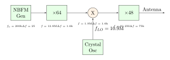
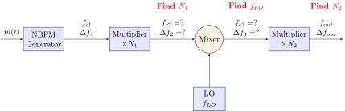

<!-- _header:  -->

# UESTC 3018 - Communication Systems and Principles

Lecture 14 — Frequency Modulation Generation

Dr Hasan Abbas
[Hasan.abbas@glasgow.ac.uk](Hasan.Abbas@glasgow.ac.uk)
<!-- transition: fade -->
<!--  -->

<!-- This is presenter note. You can write down notes through HTML comment. -->

---

# From the Morning ... ⌛

- Simplest Message Signal
- Frequency Modulation Detection
<!-- Need to change the QR code here -->

---

# Now 📆

- FM Generation

---

# The Engineering Dilemma ⚖️

To build a commercial FM station, we need two conflicting things:

1.  **High Frequency Stability**

- The center frequency ($f_c$) must not drift (FCC allows $\pm 2$ kHz tolerance).
- Crystal Oscillator is the best solution here, but they are stiff and hard to modulate.

2.  **Wide Frequency Deviation**

- Need $\Delta f = 75$ kHz for noise suppression.
- LC Tank Oscillator is flexible enough to do this, but they drift with temperature.

---

# Method 1: Direct FM Generation ⚡

- The direct method uses a Voltage-Controlled Oscillator (VCO), where the frequency is controlled by an external voltage.
- The oscillation frequency of the VCO varies linearly with the control voltage.
- An FM wave can be generated by incorporating the modulating signal $m(t)$ into the control signal.
- This results in an instantaneous angular frequency represented as:

$$\omega_i (t) = \omega_c + k_f m(t)$$

---

# The Varactor Diode FM Generator ⚡

- Need an oscillator whose frequency changes with voltage.
- Use an LC Tank Circuit where the capacitor is variable.

- Varactor Diode is a reverse-biased PN junction diode acts as a capacitor.
- Increasing the Reverse Bias voltage ($V$) widens the depletion region ($d$).
$$C = \frac{\epsilon A}{d}$$

---

# Voltage to Frequency 📐

The capacitance of a varactor under bias $V_0$ and message $m(t)$ is:
$$C(t) = C_0 \left(1 + \frac{m(t)}{V_0}\right)^{-1/2}$$

The oscillator frequency is determined by the tank circuit:
$$\omega_i(t) = \frac{1}{\sqrt{L C(t)}} = \frac{1}{\sqrt{L C_0}} \left(1 + \frac{m(t)}{V_0}\right)^{1/4}$$

---

# Linearising the Derivation

We define the carrier frequency as $\omega_c = \frac{1}{\sqrt{L C_0}}$.
If the message is small ($m(t) \ll V_0$), we use the Binomial Series $(1+x)^n \approx 1 + nx$:

$$\omega_i(t) \approx \omega_c \left(1 + \frac{1}{4} \frac{m(t)}{V_0}\right)$$

This matches our definition of FM:
$$\omega_i(t) = \omega_c + k_f m(t)$$

---

# Indirect FM (Armstrong) 📻

Instead of forcing an unstable oscillator to wiggle, we take a different approach,

1.  Start with a **Crystal Oscillator**
2.  Generate **Narrowband FM (NBFM)**
3.  Use math (multipliers) to "stretch" it into **Wideband FM**
   

---

# Narrowband FM Generation

- Recall, for narrowband FM, $|k_f a(t)| \ll 1$
$$
\psi^{\mathrm{NBFM}}(t) \simeq A \left[ \cos \omega_c t - k_f a(t) \sin \omega_c t \right]
$$
- This is a linear (simpler) system
- We can use an AM modulator (DSB-SC) with a phase shifter ($\sin \omega_c t$)

---

# Narrowband FM Generation

- The above is simple, yet there are some artefacts
- Some amplitude modulation remains in the system

---

# The Limiter and Bandpass Filter

- Amplitude variations create noise and interference 👎
- We first use a limiter circuit to limit any amplitude fluctuations
$$
v_o(t)= \begin{cases}+1 & v_i(t)>0 \\ -1 & v_i(t)<0\end{cases}
$$
- A non-linear circuit that "clips" the signal. 
- It turns the wobbly sine wave into a constant-amplitude **Square Wave**.

---

# The Limiter and Bandpass Filter (contd.)

- Selects the fundamental frequency of the square wave and rejects the harmonics ($3\omega_c, 5\omega_c \dots$).
- The input to the limiter and bandpass filter blocks is,
$$
v_{i}(t)=A(t)\cos\theta(t) \, \mathrm{,}\, \theta(t)=2\pi f_{c}t+k_{f}a(t)
$$
- $A(t)$ is ideally constant but usually very slowly varying
$$
v_o(\theta)= \begin{cases}+1 & \cos \theta >0 \\ -1 & \cos \theta<0\end{cases}
$$

---

$$
\begin{aligned}
    v_{o}(\theta) &= \frac{4}{\pi}\left(\cos\theta-\frac{1}{3}\cos 3\theta+\frac{1}{5}\cos 5\theta+\cdots\right) \\
    {}&= \frac{4}{\pi}\Big(\cos\left(2\pi f_{c}t+k_{f}a(t)\right)-\frac{1}{3}\cos 3\left(2\pi f_{c}t+k_{f}a(t)\right)+\cdots\Big)
\end{aligned}
$$

---

# Next: The Multiplier Chain 🔗

We now have a stable NBFM signal, but $\Delta f$ is tiny (e.g., 25 Hz). We need $75 kHz$.

### Frequency Multiplier ($\times N$)
Passes signal through non-linear amp (Class C) to generate harmonics.
- Freq $\times N$
- Deviation $\times N$
- $\beta \times N$

### Mixer / Heterodyne ($\pm f_{LO}$)
Multiplies by local oscillator $\cos(\omega_{LO}t)$.
- Freq $\pm f_{LO}$
- Deviation Unchanged
- $\beta$ Unchanged

---

# Design Example: The "Radio Station" 🧮

- Transmit at **91.2 MHz** with $\Delta f = 75$ kHz.
- We have a source: Crystal NBFM at **200 kHz** with $\Delta f = 25$ Hz.

- 1. Calculate Total Multiplication:
$$N_{total} = \frac{\Delta f_{target}}{\Delta f_{start}} = \frac{75,000}{25} = 3000$$

2. The Carrier Problem:
If we just multiply by 3000:
$$f_c = 200 \text{ kHz} \times 3000 = 600 \text{ MHz}$$
*This is way too high! We need a Mixer.*

---

# The Full Armstrong Diagram

We split the multiplication ($64 \times 48 \approx 3000$) and insert a **Mixer** in the middle to down-shift the carrier.

**Logic Trace:**
1.  **$\times 64$:** Carrier $\to$ 12.8 MHz. Deviation $\to$ 1.6 kHz.
2.  **Mixer:** Down-convert 12.8 MHz $\to$ 1.9 MHz. **Dev stays 1.6 kHz.**
3.  **$\times 48$:** Carrier $\to$ 91.2 MHz. Dev $\to$ 75 kHz. **Success!**

---

# Summary: Direct vs Indirect

| Feature        | Direct FM (VCO)         | Indirect FM (Armstrong)       |
| :------------- | :---------------------- | :---------------------------- |
| **Stability**  | Poor (drifts with Temp) | **Excellent** (Crystal)       |
| **Bandwidth**  | Wide deviation is easy  | Needs multipliers to get Wide |
| **Complexity** | Simple (1 Transistor)   | Complex (dozens of stages)    |
| **Use Case**   | Cheap Radios, Toys      | **Broadcast Stations**        |

---

# Advantages of FM

- FM is less susceptible to amplifier non-linearities
$$
x(t)=A\cos(\omega_{c}t+\psi(t))
$$
- The output that we get is,
$$
\begin{aligned}
y(t) &= a_{0}+a_{1}x(t)+a_{2}x^{2}(t)+\cdots\\ 
{}&= c_{0}+c_{1}\cos(\omega_{c}t+\psi(t))+c_{2}\cos(2\omega_{c}t+2\psi(t))+\cdots
\end{aligned}
$$
- For amplitude modulation, the output is, $y(t) = a x(t)+bx^{3}(t)$
$$
\begin{aligned}
y(t) &=a m(t)\cos\omega_{c}t+b m^{3}(t)\cos^{3}\omega_{c}t \\
&{}= (a m(t)+\frac{3}{4}b m^{3}(t))\cos\omega_{c}t+\frac{1}{4}b\cos3\omega_{c}t
\end{aligned}
$$

---

# Exercise

Design an Armstrong indirect FM transmitter system that takes a Narrowband FM (NBFM) signal with a known starting carrier frequency $f_{c1} = 200 kHz$ and frequency deviation $\Delta f_1 = 25 Hz$, and converts it to a Wideband FM signal with a target carrier frequency $f_{out} = 96 MHz$ and target frequency deviation greater than $\Delta f_{out} = 75 KHz$. The design task is to calculate the required multiplication factors $N_1$ and $N_2$, and the local oscillator frequency $f_{LO}$ for the mixer stage to achieve these target specifications.

---

---

# Further Reading 

- Section 4.9 - Generating FM Signals
Modern Digital and Analog Communication Systems, $5^{th}$ Edition
- B P Lathi and Zhi Ding

---

# Get in touch

Hasan.Abbas@glasgow.ac.uk 