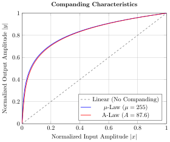

---

<!-- _header:  -->

# UESTC 3018 - Communication Systems and Principles

Lecture 17 — Quantisation 

Dr Hasan Abbas
[Hasan.abbas@glasgow.ac.uk](Hasan.Abbas@glasgow.ac.uk)
<!-- transition: fade -->
<!--  -->

<!-- This is presenter note. You can write down notes through HTML comment. -->

---

# From Last Time ⌛

- Sampling
- Pulse Modulation

---

# Today's Lecture 📆

- Quantisation
- Encoding

---

# Putting all the effort!

<!-- Import Hanzi Writer HTML Stuff -->

  

  

  

  

---

# <!--fit--> Digital Modulation

---

# Analog vs Digital Communication

- Analogue communication (baseband and modulated) is subject to noise.
- Pulse modulations (PAM, PWM, PPM) represent analogue signals by analogue variations in pulses and are also subject to noise.
- Long distance communication requires repeaters, which amplify signal and noise. Each link adds noise.
- Digital communication suppresses noise by regenerating signal.

---

# The Digital Communication Paradigm

---

# The Bridge to Digital

### Recap: The Sampling Theorem
In the last lecture, we learned that we can represent a continuous-time signal $m(t)$ by discrete samples if:

$$f_s \ge 2B$$

**But there is a problem:**
- The *time* is discrete, but the *amplitude* is still continuous.
- A sample value of $1.23456...$ volts requires infinite precision (infinite bits) to transmit.
- We must round off the amplitude. This is **Quantisation**.

---

# Why Go Digital? The Regeneration Advantage

Why do we go through all this trouble?

**Analog Transmission:**
- Noise is additive and accumulates over distance.
- Repeaters amplify the Signal + Noise.
$$r(t) = m(t) + n_1(t) + n_2(t) + \dots$$

**Digital Transmission (PCM):**
- We send pulses (0s and 1s).
- As long as the noise isn't large enough to flip a 0 to a 1, we can **regenerate** a perfect signal.
- We trade **fidelity** for **robustness**.

---

# Pulse Code Modulation (PCM)

PCM consists of three distinc t steps:

1.  **Sampler:** Discretises Time ($t \to nT_s$).
2.  **Quantiser:** Discretises Amplitude ($m[n] \to \hat{m}[n]$).
3.  **Encoder:** Converts Levels to Binary ($L \to 010110$).

---

# PCM Block Diagram

---

# Quantisation Types

1. Uniform Quantisation
   - Equal step sizes
   - Simpler implementation
2. Non-Uniform Quantisation
   - Smaller steps for low amplitudes, larger for high amplitudes
   - Improves SQNR for signals with non-uniform distribution

---

# Uniform Quantisation

We approximate the signal range $(-m_p, m_p)$ into $L$ discrete levels.

- **$m_p$:** Peak amplitude of the signal.
- **$L$:** Number of quantization levels.
- **$\Delta v$:** The Step Size (Resolution).

$$\Delta v = \frac{2m_p}{L}$$

If we use $n$ bits per sample, then $L = 2^n$.

---

# The Quantisation Error $q(t)$

When we round a sample to the nearest level, we introduce an error.

$$q(t) = m(t) - \hat{m}(t)$$

**Properties of the Error:**
1.  The error is limited to half a step size:
    $$-\frac{\Delta v}{2} \le q(t) \le \frac{\Delta v}{2}$$
2.  For a dynamic signal, $q(t)$ looks like a random **sawtooth wave**.
3.  We treat this error as **Additive Noise** (Quantisation Noise).

---

# Quantisation Error

---

# Calculation - The Rigorous Approach (Time Domain)

Mathematically, the quantisation error $q(t)$ is a continuous signal reconstructed from error samples $q(kT_s)$. The rigorous time-averaged power is defined as:

$$
P_q = \lim_{T \to \infty} \frac{1}{T} \int_{-T/2}^{T/2} \left[ \sum_{k} q(kT_s) \mathrm{sinc} (2 \pi B t - k \pi) \right]^2 dt
$$

**Why we don't calculate it this way:**
* This integral is extremely tedious to solve directly.
* **However**, we can exploit **Orthogonality**: Since sinc functions are orthogonal, the cross-terms vanish when squared and integrated.
* **Conclusion:** The power of the continuous error wave is equal to the variance of the samples.

---

# The Statistical Approach (PDF)

Since we only need the average of the squared samples, we model the error $q$ as a **Random Variable** with a **Uniform Probability Density Function (PDF)**.

* **Range:** $(-\frac{\Delta v}{2}, \frac{\Delta v}{2})$
* **Height:** $\frac{1}{\Delta v}$ (Total area must be 1)

**The PDF $f(q)$:**
$$f(q) = \begin{cases} \frac{1}{\Delta v} & \text{if } |q| \le \frac{\Delta v}{2} \\ 0 & \text{otherwise} \end{cases}$$

---

# Calculating Noise Power ($N_q$)

We calculate the Mean Square Error (Variance) by integrating over the PDF.

$$N_q = E[q^2] = \int_{-\Delta v/2}^{\Delta v/2} q^2 f(q) dq$$

$$N_q = \int_{-\Delta v/2}^{\Delta v/2} q^2 \frac{1}{\Delta v} dq = \frac{1}{\Delta v} \left[ \frac{q^3}{3} \right]_{-\Delta v/2}^{\Delta v/2}$$

$$N_q = \frac{1}{3\Delta v} \left( \frac{\Delta v^3}{8} - \frac{-\Delta v^3}{8} \right) = \frac{\Delta v^2}{12}$$

**Result:**
The Quantisation Noise Power is **$N_q = \frac{\Delta v^2}{12}$**.

---

# Deriving the SQNR Formula

We substitute $\Delta v = \frac{2m_p}{L}$ into the noise equation to find the **Signal-to-Quantisation Noise Ratio**.

1.  **Noise Power:**
    $$N_q = \frac{1}{12} \left( \frac{2m_p}{L} \right)^2 = \frac{m_p^2}{3L^2}$$

2.  **Signal Power ($S_o$):**
    Let $S_o = \overline{m^2(t)}$ (Mean square value of the signal).

3.  **SQNR**
    $$\text{SQNR} = \frac{S_o}{N_q} = \frac{\overline{m^2(t)}}{m_p^2 / 3L^2} = 3L^2 \frac{\overline{m^2(t)}}{m_p^2}$$

---

# The "6dB Rule" (in Decibels)

If we use $n$ bits, then $L = 2^n$. Converting SQNR to dB:

$$\text{SQNR}_{dB} = 10 \log_{10} \left( 3 \cdot (2^n)^2 \cdot \frac{\overline{m^2(t)}}{m_p^2} \right)$$

Using log laws ($10\log_{10}(2^{2n}) \approx 6n$):

$$\text{SQNR}_{dB} \approx 4.8 + 6n + 10 \log_{10} \left( \frac{\overline{m^2(t)}}{m_p^2} \right)$$

**The Golden Rule:**
Adding **1 bit** to the quantizer adds **6 dB** to the SQNR.

---

# Example

What bandwidth is needed to transmit a PCM signal for a voice channel (3 kHz bandwidth) if we require the maximum quantisation error to be less than $0.5\%$ of the peak amplitude?

---

# Example Calculation

### Analyse:
1.  **Constraint:** Max error $|q_{max}| \le \frac{\Delta v}{2} = 0.5\% \text{ of } m_p$.
2.  **Find Levels ($L$):** Solve for $L$ using $\Delta v = \frac{2m_p}{L}$.
3.  **Find Bits ($n$):** Calculate $n = \lceil \log_2 L \rceil$.
4.  **Find Rate:** $R_b = n \cdot f_s$ (where $f_s \ge 2B$). **Bandwidth:** Minimum $BW = R_b / 2$.

- 1/L < 0.005 --> L > 200.
- Nearest power of 2 is 256 (8 bits).
- fs = 6kHz (Nyquist).
- Rate = 6 * 8 = 48 kbps.
- Min Bandwidth = 24 kHz.

---

# Quantisation Error

---

# <!--fit--> Non-uniform Quantisation

---

# The Weak Signal Problem

**Uniform Quantisation has a fatal flaw.**
- The step size $\Delta v$ is fixed.
- **Loud signals:** Use many levels $\to$ High SQNR.
- **Quiet signals:** Use very few levels $\to$ Low SQNR.

**Example:**
- In human speech, we speak quietly 80% of the time.
- With uniform quantisation, quiet speech sounds "grainy" or "fuzzy" because the signal power $\overline{m^2}$ is small, but noise $N_q$ is constant.

$$\text{SQNR} = \frac{\text{Small Signal}}{\text{Fixed Noise}} = \text{Poor Quality}$$

---

# Companding (Non-Uniform Quantisation)

- Make the step size adaptive.
- **Small steps** for small signals (high precision).
- **Large steps** for large signals (lower precision, but signal is loud so it masks the noise).

**But How?**
1.  **Compress:** Pass signal through a logarithmic amplifier.
2.  **Quantise:** Use a uniform quantiser.
3.  **Expand:** Inverse the process at the receiver.

**COMP**ress + ex**PAND** = **COMPANDING**

---

# Companding Standards

We use logarithmic compression curves.

**1. A-Law (Europe & China Standard):**
$$y = \begin{cases} \frac{A |x|}{1 + \ln A} & 0 \le |x| \le \frac{1}{A} \\ \frac{1 + \ln(A |x|)}{1 + \ln A} & \frac{1}{A} \le |x| \le 1 \end{cases}$$
- Standard $A = 87.6$.
- Used in the systems you will work with in China.

**2. $\mu$-Law (North America & Japan):**
* Similar concept, slightly different curve ($\mu = 255$).

---

# The Bandwidth Trade-off

We achieved robust, noise-free communication. **What did it cost?**

It cost us **Bandwidth**.

- Analog Signal Bandwidth: $B$
- Sampling Rate: $f_s \ge 2B$
- Bits per sample: $n$
- **PCM Bit Rate:** $R_b = n \cdot f_s \ge 2nB$

**Minimum Transmission Bandwidth:**
$$BW_{PCM} \ge \frac{1}{2} R_b = nB$$

We need $n$ times more bandwidth than the original analog signal!

---

# Bandwidth vs. SNR Exchange Rate

Is the trade-off worth it?

- **FM (Analog):** SNR improves **linearly** with Bandwidth expansion.
    - Double the bandwidth $\to$ Double the SNR (+3 dB).
- **PCM (Digital):** SNR improves **exponentially** with Bandwidth expansion.
    - Double the bandwidth (double $n$) $\to$ Square the SNR (Double the dB).
    - Example: going from 8 bits to 16 bits doubles the bandwidth, but SNR goes from 48dB to 96dB!

**Conclusion:** PCM offers a much better "exchange rate" for trading bandwidth for signal quality.

---

# Real World Example: The DS0 Channel

The fundamental unit of the global telephone network (PSTN).

- **Voice Bandwidth:** 300 Hz - 3400 Hz (Approx 4 kHz).
- **Sampling:** $f_s = 8000$ samples/sec (Nyquist satisfied).
- **Quantisation:** $n = 8$ bits (using A-law Companding).
- **Bit Rate:**
    $$8000 \times 8 = 64,000 \text{ bits/sec} = 64 \text{ kbps}$$

This 64 kbps channel is the standard **DS0** (Digital Signal 0), the building block of ISDN, E1, and T1 lines.

---

# Encoding: Line Coding

- Translates bits into physical signals for transmission
- Common techniques:
  - **NRZ** (Non-Return-to-Zero): High for '1', low for '0'
  - **Manchester**: Combines data and clock
  - **RZ** (Return-to-Zero): Short pulses
- Applications:
  - Ethernet, serial communication

---

# Encoding: Source Coding

- Compresses data for efficient transmission
- Key algorithms:
  - **Huffman Coding**: Variable-length codes for frequent symbols
  - **Shannon Entropy**: Measures minimum average bits per symbol
- Example
$$
  H(X) = - \sum_{i} P(x_i) \log_2 P(x_i)
$$

---

# Equalisation: Basics

- **Purpose**: Mitigate distortions caused by the channel
- Channel impairments:
  - Noise
  - Inter-Symbol Interference (ISI)
- Frequency-domain representation:
$$
  Y(f) = H(f) \cdot X(f) + N(f)
$$

---

# Equalisation Techniques
1. **Zero-Forcing Equaliser**
   - Inverts channel response: $H_{\text{ZF}}(f) = \frac{1}{H(f)}$
   - Eliminates ISI but amplifies noise
2. **MMSE Equaliser**
   - Balances noise and ISI reduction
   - Optimal in terms of minimizing mean-square error

--- 

# Questions ❓
- You can ask on Menti
<!-- 
<!-- Need to change the QR code here -->

---

# Further Reading 

- Section 5.2 - Pulse Code Modulation
Modern Digital and Analog Communication Systems, $5^{th}$ Edition
- B P Lathi and Zhi Ding

---

# Get in touch

Hasan.Abbas@glasgow.ac.uk 