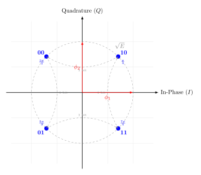

---

# UESTC 3018 - Communication Systems

Lecture 19 — Digital Modulation: From Binary to M-ary
*Signal Space, Constellations, and Bandwidth*

Dr Hasan Abbas
[Hasan.abbas@glasgow.ac.uk](Hasan.Abbas@glasgow.ac.uk)

---

# Today's Roadmap 🗺️

1.  **The Modulation Concept:** Moving to Passband.
2.  **Geometric View:** Signal Space & Basis Functions ($I/Q$).
3.  **Binary Modulation:**
    - Amplitude (BASK)
    - Frequency (BFSK)
    - Phase (BPSK)
4.  **Quadrature Modulation:** QPSK.
5.  **M-ary Schemes:** 16-QAM and Spectral Efficiency.

---

# Part 1: The Modulation Concept

**Baseband (Lecture 18):**
Signal $m(t)$ is at low frequencies (near DC).
*Problem:* Requires huge antennas ($\lambda/4 \approx 25$ km for voice).

**Passband (Lecture 19):**
We shift the signal to a Carrier Frequency $f_c$.

$$s(t) = A(t) \cos(2\pi f_c t + \phi(t))$$

We can vary:
1.  **Amplitude** ($A$) $\to$ ASK
2.  **Frequency** ($f$) $\to$ FSK
3.  **Phase** ($\phi$) $\to$ PSK

---

# Geometric Representation (Signal Space)

To understand modern comms, we don't draw waves; we draw **Vectors**.

We define two **Basis Functions** (Axes) that are Orthogonal:

**1. In-Phase ($I$):**
$$\phi_1(t) = \sqrt{\frac{2}{T}} \cos(2\pi f_c t)$$

**2. Quadrature ($Q$):**
$$\phi_2(t) = \sqrt{\frac{2}{T}} \sin(2\pi f_c t)$$

**The Vector:**
Any signal $s_i(t)$ is a point:
$$\mathbf{s}_i = [s_{i1}, s_{i2}]$$

**Energy:**
Distance from origin squared.
$$E = ||\mathbf{s}_i||^2$$

---

# Part 2: Binary Digital Modulation ($M=2$)

We transmit **1 bit per symbol**.
We need 2 distinct signals: $s_1(t)$ and $s_2(t)$.

### 1. Binary Amplitude Shift Keying (BASK)
"On-Off Keying"

- **Bit 1:** Send Carrier ($\sqrt{E_b}$).
- **Bit 0:** Send Nothing ($0$).

**Constellation:**
- Points at $[0]$ and $[\sqrt{E}]$.
- **Pros:** Simple (Light bulb on/off).
- **Cons:** Susceptible to noise (Amplitude varies naturally).

---

# 2. Binary Frequency Shift Keying (BFSK)

We use frequency to distinguish bits.

- **Bit 1:** Send $f_1 = f_c + \Delta f$.
- **Bit 0:** Send $f_2 = f_c - \Delta f$.

**Orthogonality Condition:**
To detect these independently, the frequencies must be spaced by $\Delta f = \frac{1}{2T_b}$.

**Constellation:**
- Vectors are orthogonal (90 degrees apart).
- Points at $[1, 0]$ and $[0, 1]$ in frequency space.
- **Cons:** Uses **more Bandwidth** than ASK/PSK.

---

# 3. Binary Phase Shift Keying (BPSK)

The most robust binary scheme. We flip the phase by $180^\circ$.

$$s(t) = \pm A \cos(2\pi f_c t)$$

**Constellation:**

- Points at $+\sqrt{E_b}$ and $-\sqrt{E_b}$ on the I-axis.
- **Antipodal:** Max separation distance $d = 2\sqrt{E_b}$.
- **Q-Component:** Zero.

**Bandwidth Efficiency:** 1 bit / Hz.

---

# Part 3: Quadrature Modulation (QPSK)

**The Engineering Breakthrough:**
Since $\cos(t)$ and $\sin(t)$ are orthogonal, we can transmit two separate BPSK signals on the same frequency **simultaneously**.

**Quadrature PSK:**
- **I-Channel:** Carries Bit 1 ($\cos$).
- **Q-Channel:** Carries Bit 2 ($\sin$).

**Result:**
We send **2 bits per symbol**.

---

# QPSK Signal Space

**Constellation:**
- 4 Points.
- Phases: $45^\circ, 135^\circ, 225^\circ, 315^\circ$.
- Energy $E_s = 2E_b$.

**Gray Coding:**
00, 01, 11, 10
(Adjacent points differ by only 1 bit).

---

# Comparison: BPSK vs QPSK

This is the most critical comparison in digital comms.

| Metric                     | BPSK  |   QPSK    |
| :------------------------- | :---: | :-------: |
| Bits per Symbol            |   1   |     2     |
| Data Rate (for fixed BW)   |  $R$  | **$2R$**  |
| Bandwidth (for fixed Rate) |  $B$  | **$B/2$** |
| Error Performance (BER)    | Same  |   Same    |

> **Takeaway:** QPSK doubles the efficiency of BPSK without penalizing error rate or bandwidth. It is the "sweet spot."

---

# Part 4: M-ary Modulation ($M > 4$)

We can group $k$ bits into a symbol ($M = 2^k$).

**Generalizing the I/Q Modulator:**
$$s(t) = I \cdot \cos(2\pi f_c t) - Q \cdot \sin(2\pi f_c t)$$

Instead of just $\pm 1$, let $I$ and $Q$ take multiple levels (e.g., $\pm 1, \pm 3$).

This creates a **Grid** of points called **QAM** (Quadrature Amplitude Modulation).

---

# 16-QAM Constellation

- **$M=16$ symbols.**
- **$k=4$ bits per symbol.**

**Structure:**
- 4 levels for I.
- 4 levels for Q.
- Square Grid.

**Efficiency:**
- 4 bits/sec per Hz.
- 4x faster than BPSK.

---

# The Cost of M-ary Modulation

There is no free lunch after QPSK.

**1. Noise Susceptibility:**
As $M$ increases (16 $\to$ 64 $\to$ 256), points get packed closer together.
$\implies$ We need higher **SNR** (Transmit Power) to keep errors low.

**2. Complexity:**
Receiver needs precise amplitude and phase tracking.

---

# Spectral Efficiency Summary

How many bits can we squeeze into 1 Hz of Bandwidth?

| Modulation  | Efficiency ($\eta$) | Application                  |
| :---------- | :-----------------: | :--------------------------- |
| **BPSK**    |     1 bit/s/Hz      | GPS, Deep Space (Robust)     |
| **QPSK**    |     2 bits/s/Hz     | Satellite TV, 3G             |
| **16-QAM**  |     4 bits/s/Hz     | Wi-Fi (g/n), 4G LTE          |
| **64-QAM**  |     6 bits/s/Hz     | Wi-Fi (ac), 5G (Good signal) |
| **256-QAM** |     8 bits/s/Hz     | 5G (Close to tower)          |

---

# Summary

1.  **Signal Space:** We map waveforms to vectors $(I, Q)$. Euclidean distance determines performance.
2.  **Binary (BPSK):** Robust, simple, 1 bit/sym.
3.  **Quadrature (QPSK):** Uses Orthogonality to double the data rate (2 bits/sym) in the same bandwidth.
4.  **M-ary (QAM):** Increases rate further ($\log_2 M$ bits/sym) but requires much higher **Power/SNR**.

---

# Questions ❓
- You can ask on Menti

---

# Further Reading

- **Afsaneh's Lecture Notes:** Focus on the QPSK and QAM derivation.
- **Lathi Chapter 6:**
  - 6.4 (Bandpass Modulation)
  - 6.7 (M-ary Modulation)

---

# Get in touch

Hasan.Abbas@glasgow.ac.uk