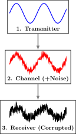

---

<!-- _header:  -->

# UESTC 3018 - Communication Systems and Principles

Lecture 16 — Going Discrete (Sampling)

Dr Hasan Abbas
[Hasan.abbas@glasgow.ac.uk](Hasan.Abbas@glasgow.ac.uk)
<!-- transition: fade -->
<!--  -->

<!-- This is presenter note. You can write down notes through HTML comment. -->

---

# Last Week ... ⌛

- Frequency Modulation Generation and Detection
<!-- Need to change the QR code here -->

---

# Keep Calm and Carry on!

<!-- Import Hanzi Writer HTML Stuff -->

  

  

  

  

---

# Today's Lecture 📆

- The (im)Pulse train
- Sampling Theorem
- Pulse Train
- Digital Modulation!

---

# <!--fit-->  Analog vs Digtal ⚔️ 

---

# Why Switch?

### The (Analog) Problem

- Signal travels over a channel $\to$ Noise is added.
- Repeaters amplify the *Signal + Noise*.
- **Result:** Noise accumulates forever.

**Digital Solution:**
- We only send discrete symbols (0s and 1s).
- Repeaters don't amplify; they **Regenerate**.
- "Is it a 1 or a 0?" $\to$ Create a fresh, perfect 1.
- **Result:** Noise is completely stripped away at each hop.

---

# Real-Life Context: Why switch? 

1.  **Generational Leap:**
    - **1G (Analog):** Noisy voice, easy to eavesdrop.
    - **2G (GSM/Digital):** Clean voice, encryption, SMS.
    - **5G (Digital):** Massive bandwidth, error correction coding.

---

# Some Math - Sampling Theorem 📐

To digitise a signal, we must first freeze time.

**Ideal Sampling:**
We multiply a continuous signal $g(t)$ by an impulse train $III(t)$.

$$g_s(t) = g(t) \cdot \sum_{k=-\infty}^{\infty} \delta(t - kT_s)$$

---

# Some Math - Sampling Theorem 📐

In the Frequency Domain:
Multiplication in Time $\leftrightarrow$ Convolution in Frequency.
$$G_s(f) = f_s \sum_{k=-\infty}^{\infty} G(f - k f_s)$$

*Result: The spectrum $G(f)$ repeats every $f_s$.*

---

- A signal $g(t)$ with bandwidth $<B$ can be reconstructed exactly from samples taken at any rate $R>2B$.
- Sampling can be achieved mathematically by multiplying by an impulse train.

$$
III(t) = \sum_{k = -\infty}^{\infty} \delta (t - k)
$$

- Also called a comb function

$$
\overline{g}(t) = III(t)g(t) = \sum_{k = -\infty}^{\infty} g(t)\delta (t - kT) = \sum_{k = -\infty}^{\infty} g(kT_s)\delta (t - kT_s)
$$

---

# The Impulse Train

- Interesting the Fourier Transform of an impulse train is also an impulse train
- The complex exponentials cancel at non-integer frequencies and add up to an impulse at integer frequencies

$$
\mathcal{F} {III(t)} = \mathcal{F} \sum_{k = -\infty}^{\infty} g(t)\delta (t - k) = \int_{-\infty}^{\infty} e^{-j2\pi n f} =  III(f)
$$

---

# Fourier Transform of a Sampled Signal

The impulse train $III(t/Ts)$ is periodic with period $T_s$ and can be represented as the sum of complex exponentials of all multiples of the
fundamental frequency (Fourier Series),

$$
III(t/Ts) = 1/Ts \sum_{k = -\infty}^{\infty} e^{-j2\pi f_s t} 
$$

- $f_s = 1/T_s$

---

# A Sampled Signal

---

# Sampled Signal and the Fourier Transform

---

# Sampled Cosines

---

# Sampled Examples

---

# The Minimum Sampling Rate
  
- When the sampling rate is too low, the spectral replicas overlap

---

# The Nyquist-Shannon Theorem 📏

To prevent the spectral copies from overlapping (*aliasing*), we need:

$$
f_s - B \ge B \quad \Rightarrow \quad f_s \ge 2B
$$

- **Nyquist Rate:** $2B$ samples/sec.
- **Example:** Human voice goes up to 3.4 kHz.
  - Telephone samples at **8 kHz** (safe margin).
- **Example:** Human hearing goes up to 20 kHz.
  - CD Audio samples at **44.1 kHz** (safe margin).

---

# Aliasing 

- The spectral overlap

- The shaded frequencies overlap and are ambiguous.
- High positive frequencies wrap around to high negative frequencies
- What signal would you reconstruct if you assumed the signal was actually band limited?

---

# Aliasing Contd.

- Cosines at frequencies of 0.75 Hz and 1.25 Hz produce exactly the same samples at a sampling rate of 1 Hz

---

# Anti-aliasing Filter

- In practice, a sampler is always preceded by a filter to limit the signal bandwidth to match the sampling rate
- This may delete part of the signal if it isn’t bandlimited.
- It ensures that the signal that is sampled is bandlimited.

---

# Reconstruction

- In an ideal world ...
- To avoid spectral overlap, we need to ensure the sampling frequency is $>= 2B$

---

# Realistic Reconstruction

- Due to causality we can't really have an ideal low-pass filter

---

# Practical Sampling 🚧

We cannot generate an infinite impulse train ($III(t)$).
In reality, we hold the switch closed for a tiny moment, or use a "Sample and Hold" circuit.

**Flat-Top Sampling:**
Instead of impulses, we get rectangular pulses of width $\tau$.
$$
g_{flat}(t) = \sum g(nT_s) \cdot \text{rect}\left(\frac{t - nT_s}{\tau}\right)
$$

**The Problem:** The rectangular pulse shape in Time corresponds to a **Sinc function** in Frequency.

---

# The Aperture Effect (Sinc Distortion) 📉

**The Sinc Envelope**
The spectrum is multiplied by $P(f) = \tau \cdot \text{sinc}(f\tau)$.
This acts like a Low Pass Filter, rolling off high frequencies.

**The Fix: Equalizer**
We use an Inverse Sinc filter: $H_{eq}(f) = 1/\text{sinc}(f\tau)$.
This boosts the high frequencies back to normal.

---

# Pulsed Sampling

- In reality, we will always a finite time pulse
- This will lead to further changes in the shape of the sampled signal

---

# Equalisation

- At the recovery/reconstruction
- Equalisation is akin to frequency inversion (more later)

---

# Different Kinds of Pulses

---

# <!--fit--> Digital Modulation

---

# Digital Modulation

- Digital Communications
- Analog vs Digital Communication
- Pulse Code Modulation (PCM)
- Quantisation

---

# Analog vs Digital Communication

- Analogue communication (baseband and modulated) is subject to noise.
- Pulse modulations (PAM, PWM, PPM) represent analogue signals by analogue variations in pulses and are also subject to noise.
- Long distance communication requires repeaters, which amplify signal and noise. Each link adds noise.
- Digital communication suppresses noise by regenerating signal.

---

# The Digital Communication Paradigm

---

# Questions ❓
- You can ask on Menti
<!-- 
<!-- Need to change the QR code here -->

---

# Further Reading 

- Section 5.1 - Sampling Theorem
Modern Digital and Analog Communication Systems, $5^{th}$ Edition
- B P Lathi and Zhi Ding

---

# Get in touch

Hasan.Abbas@glasgow.ac.uk 