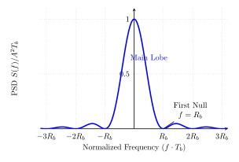
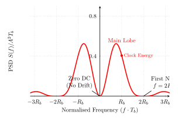

---

<!-- _header:  -->

# UESTC 3018 - Communication Systems and Principles

Lecture 18 — From Bits to Symbols, Baseband to Passband

Dr Hasan Abbas
[Hasan.abbas@glasgow.ac.uk](Hasan.Abbas@glasgow.ac.uk)
<!-- transition: fade -->
<!--  -->

<!-- This is presenter note. You can write down notes through HTML comment. -->

---

# From Last Time ⌛

- Quantisation

---

# Today's Lecture 📆

- Line Coding
- Pulse Code Modulation
- Delta Modulation
- Inter-Symbol Interference

---

# You are the youngest today!

<!-- Import Hanzi Writer HTML Stuff -->

  

  

  

  

---

# <!--fit--> Baseband Transmission

---

# Encoding & Line Coding

- We have a logical sequence: `1 0 1 1 0`.

- A wire (medium) doesn't understand (digital) logic; it only understands **voltage**.

**Line Coding** is the mapping of logical bits to physical waveforms.

### Key Design Goals

1.  Synchronisation The receiver needs to recover the clock.
2.  **Bandwidth Efficiency:** Fit more data in less Hz.
3.  **DC Balance:** Ideally zero DC (transformers block DC).

---

## Line Coding Schemes (RZ)

| Scheme           | Signal Levels | Features                                                                                                            |
| :--------------- | :------------ | :------------------------------------------------------------------------------------------------------------------ |
| **On-Off (RZ)**  | $V, 0$        | High $V$ for half bit, then 0. Simple, clear transitions, requires more bandwidth.           |
| **Polar (RZ)**   | $+V, 0, -V$   | $+V$ for half bit (1), $-V$ for half bit (0). Eliminates DC component, good synchronisation. |
| **Bipolar (RZ)** | $+V, 0, -V$   | Alternates between $+V$ and $-V$ for 1s. No DC component, good error detection.              |

---

# Common Line Codes

### 1. NRZ (Non-Return to Zero)
- `1` = $+V$, `0` = $-V$.
- 🙂 Simple, low bandwidth.
- 🙁 Long strings of 1s cause loss of sync (DC buildup).

### 2. Manchester Encoding
- `1` = High $\to$ Low; `0` = Low $\to$ High.
- 🙂Guaranteed transition every bit (Great Sync).
-  🙁 Uses **2x Bandwidth**.

---

# The Bandwidth of Line Codes

To understand bandwidth, we look at the **Power Spectral Density (PSD)**. This depends on two things:

1. The Shape of the Pulse ($P(f)$):
- A sharp square pulse has a wide frequency spread.
2. The Pattern of the Bits ($R_k$):
-  Do 1s and 0s follow a pattern, or are they random?

$$
S(f) = \underbrace{\frac{1}{T_b} |P(f)|^2}_{\text{Shape}} \times \underbrace{\sum R_k e^{-j\dots}}_{\text{Pattern}}
$$

---

# For Random Data ...

In real data (compressed audio/video), bits are random (like coin flips).

1. No Patterns ($R_k = 0$):
- Knowing bit $N$ tells us nothing about bit $N+1$.
- Because there is no pattern, the complex sum $\sum (\dots)$ vanishes!

1. Average Power ($\sigma^2 \to A^2$):
- For a signal swinging between $+A$ and $-A$, the "Variance" is just the amplitude squared.
- Variance = Power = $A^2$.

---

# Derivation: NRZ Bandwidth

For NRZ, we use a rectangular pulse.
- Pulse Shape: $P(f) = T_b \text{sinc}(f T_b)$
- Pattern: Random ($R_k=0$, sum disappears).

The PSD becomes just the Pulse Shape squared $\times$ Power:

$$S_{NRZ}(f) = A^2 T_b \text{sinc}^2(f T_b)$$

### Observation
- The first null is at $f = R_b$.
- Most power is packed in the low frequencies (Baseband).

---

# Manchester Bandwidth

Manchester uses a "split" pulse ($+V$ then $-V$).
$$P(f) = T_b \text{sinc}\left(\frac{f T_b}{2}\right) \sin\left(\frac{\pi f T_b}{2}\right)$$

$$S_{Manc}(f) = A^2 T_b \text{sinc}^2\left(\frac{f T_b}{2}\right) \sin^2\left(\frac{\pi f T_b}{2}\right)$$

### Observation
1. $\sin(0) = 0 \to$ **Zero DC**.
2. The null is pushed to $f = 2/T_b = 2R_b$.
3. Manchester requires **2x Bandwidth**.

---

# Pulse Code Modulation (PCM)

PCM is the standard for uncompressed digital audio (CDs etc).

- Bit Rate ($R_b$):
$$R_b = n \times f_s$$

- Dynamic Range (SQNR):
$$\text{SQNR}_{dB} \approx 4.8 + 6n$$

---

# PCM Bandwidth

Digital signals require significantly more bandwidth than the original analog signal.

- Analog Voice: $4 \text{ kHz}$.
- PCM Voice (8 bits, 8 kHz): $64 \text{ kbps}$.

- Minimum Transmission Bandwidth:
$$BW_{PCM} \ge \frac{1}{2} R_b = \frac{1}{2} n f_s$$

We trade Bandwidth for Noise Immunity and Regenerability.

---

# Delta Modulation (DM)

PCM sends the *absolute* value of every sample.

- 💡 Adjacent samples are usually similar (high correlation). Why send the whole value?

- Only transmit the change (slope) from the last sample.
- 1 bit per sample:
-  `1`: Signal went UP ($+\Delta$).
- `0`: Signal went DOWN ($-\Delta$).

- Extremely simple hardware (1-bit ADC).

---

# Inter-Symbol Interference (ISI)

Real channels act like Low Pass Filters. They "smear" pulses.
- The "tail" of one pulse spills into the next time slot.
- This is **ISI**. It ruins our ability to distinguish `1` from `0`.

**Ideal Pulse:**
Square (Requires $\infty$ Bandwidth).

**Real Pulse:**
Rounded and spread out.

---

# The Eye Diagram

---

# Visualising ISI: The Eye Diagram

If we overlay thousands of received bit periods on an oscilloscope, we get an **Eye Diagram**.

- Vertical Opening (Height): Noise Margin. How much noise can we tolerate?
- Horizontal Opening (Width): Jitter Margin. How sensitive is the timing?
- Closed Eye: The system has failed. ISI is dominant.

---

# The Nyquist Criterion

How do we eliminate ISI without infinite bandwidth?
**Nyquist's First Criterion:**
Find a pulse $p(t)$ such that $p(nT_b) = 0$ for all $n \neq 0$.

**The Sinc Pulse:**
$$p(t) = \text{sinc}\left(\frac{t}{T_b}\right)$$
- Bandwidth $= R_b/2$ (Minimum possible).
- Hard to generate, sensitive to timing errors.
- Raised Cosine Filter (Trade a little bandwidth for robustness).

---

# Equalisation

Nyquist pulses work in *ideal* channels. Real channels add their own filtering $H_c(f)$, causing ISI.

$$Y(f) = X(f)H_c(f) + \text{Noise}$$

We insert an **Equaliser** filter $H_{eq}(f)$ at the receiver to reverse the damage.

### Zero Forcing Equaliser

$$H_{eq}(f) = \frac{1}{H_c(f)}$$

- Ideally restores the signal, but may amplify noise.

---

# The Guard Band

Nyquist says we *can* transmit at $B = R_b/2$.
- We cannot build perfect "Brick Wall" filters to separate these signals.

- Real filters have a gradual "roll-off" (slope).
- If we pack channels too tightly, their "tails" overlap.
- Adjacent Channel Interference (ACI).

We deliberately leave unused spectrum between channels.

---

# 📝 Example

A band-limited voice signal has a maximum frequency $f_m = 3.4 \text{ kHz}$ and maximum amplitude $A_m$. We need to digitise this signal using a guard band of $1.2 \text{ kHz}$.

1. Determine Nyquist Rate:
$$f_N = 2 \times f_m = 2 \times 3.4 \text{ kHz} = 6.8 \text{ kHz}$$

2. Compute Actual Sampling Frequency ($f_s$):
$$f_s = f_N + \text{Guard Band}$$
$$f_s = 6.8 \text{ kHz} + 1.2 \text{ kHz} = \mathbf{8.0 \text{ kHz}}$$

This is why the global standard for digital telephony (PCM) is **8 kHz**. It accommodates the 3.4 kHz voice signal plus a necessary safety margin for real-world filters.

---

# Questions ❓
- You can ask on Menti
<!-- 
<!-- Need to change the QR code here -->

---

# Further Reading 

- Sections 6.1 - 6.3, and 6.6
Modern Digital and Analog Communication Systems, $5^{th}$ Edition
- B P Lathi and Zhi Ding

---

# Get in touch

Hasan.Abbas@glasgow.ac.uk 