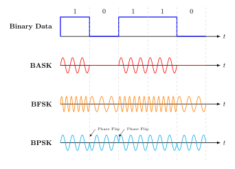
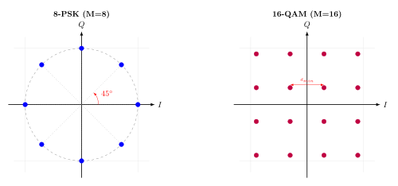

<!-- _header:  -->

# UESTC 3018 - Communication Systems and Principles

Lecture 18 — Digital Passband Communication

Dr Hasan Abbas
[Hasan.abbas@glasgow.ac.uk](Hasan.Abbas@glasgow.ac.uk)
<!-- transition: fade -->
<!--  -->

<!-- This is presenter note. You can write down notes through HTML comment. -->

---

# <!--fit--> Passband Communication

---

# Why Modulate?

- Signal $m(t)$ is at low frequencies (near DC).
- Requires huge antennas ($\lambda/4 \approx 25$ km for voice).

- We shift the signal to a Carrier Frequency $f_c$.

$$s(t) = A(t) \cos(2\pi f_c t + \phi(t))$$

We can vary:
1.  **Amplitude** ($A$) $\to$ ASK
2.  **Frequency** ($f$) $\to$ FSK
3.  **Phase** ($\phi$) $\to$ PSK

---

# Binary Digital Modulation

We switch a parameter of a sinusoidal carrier in accordance with the binary symbols `0` and `1`.

The Carrier:
$$c(t) = A_c \cos(2\pi f_c t + \phi_c)$$

We can vary:
1.  **Amplitude ($A_c$):** ASK (Amplitude Shift Keying).
2.  **Frequency ($f_c$):** FSK (Frequency Shift Keying).
3.  **Phase ($\phi_c$):** PSK (Phase Shift Keying).

- Assumption: Carrier frequency $f_c \gg$ Bit rate $R_b$.

---

# Geometric Representation of Signals

- To understand modern comms, we don't draw waves; we draw **Vectors**.

- We define two **Basis Functions** (Axes) that are Orthogonal:

1. In-Phase ($I$):
$$\phi_1(t) = \sqrt{\frac{2}{T}} \cos(2\pi f_c t)$$

2. Quadrature ($Q$):
$$\phi_2(t) = \sqrt{\frac{2}{T}} \sin(2\pi f_c t)$$

Any signal $s_i(t)$ is a point:
$$\mathbf{s}_i = [s_{i1}, s_{i2}]$$

- Energy: Distance from origin squared.
$$E = ||\mathbf{s}_i||^2$$

---

# Geometric Representation of Signals

To analyse performance (Probability of Error), we use **Vector Space Analysis**.

- 💡 Any set of $M$ energy signals $\{s_i(t)\}$ can be represented as a linear combination of $N$ orthonormal **Basis Functions** $\{\phi_j(t)\}$.

$$s_i(t) = \sum_{j=1}^{N} s_{ij} \phi_j(t), \quad 0 \le t \le T$$

- Orthonormal Condition:
$$\int_0^T \phi_i(t) \phi_j(t) dt = \begin{cases} 1 & \text{if } i=j \\ 0 & \text{if } i \neq j \end{cases}$$

---

# Binary Digital Modulation ($M=2$)

We transmit **1 bit per symbol**.
We need 2 distinct signals: $s_1(t)$ and $s_2(t)$.

### 1. Binary Amplitude Shift Keying (BASK)
"On-Off Keying"

- **Bit 1:** Send Carrier ($\sqrt{E_b}$).
- **Bit 0:** Send Nothing ($0$).

### Constellation:
- Points at $[0]$ and $[\sqrt{E}]$.
- Simple (Light bulb on/off).
- Susceptible to noise (Amplitude varies naturally).

---

# 2. Binary Frequency Shift Keying (BFSK)

We use frequency to distinguish bits.

- **Bit 1:** Send $f_1 = f_c + \Delta f$.
- **Bit 0:** Send $f_2 = f_c - \Delta f$.

Orthogonality Condition:
- To detect these independently, the frequencies must be spaced by $\Delta f = \frac{1}{2T_b}$.

Constellation:
- Vectors are orthogonal (90 degrees apart).
- Points at $[1, 0]$ and $[0, 1]$ in frequency space.
- Uses **more Bandwidth** than ASK/PSK.

---

# 3. Binary Phase Shift Keying (BPSK)

The most robust binary scheme. We flip the phase by $180^\circ$.

$$s(t) = \pm A \cos(2\pi f_c t)$$

- Constellation:

- Points at $+\sqrt{E_b}$ and $-\sqrt{E_b}$ on the I-axis.
- **Antipodal:** Max separation distance $d = 2\sqrt{E_b}$.
- **Q-Component:** Zero.

Bandwidth Efficiency: 1 bit / Hz.

---

# Quadrature Modulation (QPSK)

**The Engineering Breakthrough:**
Since $\cos(t)$ and $\sin(t)$ are orthogonal, we can transmit two separate BPSK signals on the same frequency **simultaneously**.

**Quadrature PSK:**
- **I-Channel:** Carries Bit 1 ($\cos$).
- **Q-Channel:** Carries Bit 2 ($\sin$).

**Result:**
We send **2 bits per symbol**.

---

---

# Quadriphase-Shift Keying (QPSK)

We use **4 Phases** to transmit **2 bits** (a dibit) per symbol.
Phases: $\frac{\pi}{4}, \frac{3\pi}{4}, \frac{5\pi}{4}, \frac{7\pi}{4}$.

$$s_i(t) = \sqrt{\frac{2E}{T}} \cos\left[ 2\pi f_c t + (2i-1)\frac{\pi}{4} \right], \quad i=1,2,3,4$$

### Trigonometric Expansion:
$$s_i(t) = \underbrace{\sqrt{\frac{2E}{T}} \cos(\theta_i) \cos(2\pi f_c t)}_{\text{In-Phase (I)}} - \underbrace{\sqrt{\frac{2E}{T}} \sin(\theta_i) \sin(2\pi f_c t)}_{\text{Quadrature (Q)}}$$

---

# QPSK Derivation - Expansion

Using the identity $\cos(A+B) = \cos A \cos B - \sin A \sin B$:

Let $A = 2\pi f_c t$ and $B = (2i-1)\frac{\pi}{4}$.

$$
s_i(t) = \sqrt{\frac{2E}{T}} \cos\left( (2i-1)\frac{\pi}{4} \right) \cos(2\pi f_c t) - \sqrt{\frac{2E}{T}} \sin\left( (2i-1)\frac{\pi}{4} \right) \sin(2\pi f_c t)$$

This decomposes the signal into two orthogonal components:
1.  **In-Phase Component:** Multiplies $\cos(2\pi f_c t)$
2.  **Quadrature Component:** Multiplies $\sin(2\pi f_c t)$

---

# QPSK Derivation: Basis Projection

We recall our basis functions:
$\phi_1(t) = \sqrt{\frac{2}{T}} \cos(2\pi f_c t)$  and  $\phi_2(t) = \sqrt{\frac{2}{T}} \sin(2\pi f_c t)$.

Substituting these back into our expanded equation:

$$
s_i(t) = \underbrace{\sqrt{E} \cos(\theta_i)}_{\text{Scalar } s_{i1}} \phi_1(t) - \underbrace{\sqrt{E} \sin(\theta_i)}_{\text{Scalar } s_{i2}} \phi_2(t)
$$

Thus, the signal vector is:
$$\mathbf{s}_i = \left[ \sqrt{E}\cos(\theta_i), \quad -\sqrt{E}\sin(\theta_i) \right]$$

---

# QPSK as two BPSK signals

The QPSK signal is literally the sum of two orthogonal BPSK signals.

1.  **Odd Bits** modulate the In-Phase carrier ($\phi_1$).
2.  **Even Bits** modulate the Quadrature carrier ($\phi_2$).

$$
s_i(t) = \pm \sqrt{\frac{E}{2}} \phi_1(t) \pm \sqrt{\frac{E}{2}} \phi_2(t)
$$

- ❗ Since $\phi_1$ and $\phi_2$ are orthogonal, we can detect them separately. This doubles the data rate without increasing bandwidth.

---

# QPSK Constellation

**Gray Coding:**
- Adjacent points differ by 1 bit.
- $10 \to 00 \to 01 \to 11$.

**Bandwidth:**
- $R_{sym} = R_b / 2$.
- Bandwidth = $R_b / 2$ Hz.
- Half the bandwidth of BPSK for the same bit rate.

---

---

# Example

You are designing a digital radio link to stream high-quality audio. 
Required Data Rate ($R_b$): $3 \text{ Mbps}$.Available Channel Bandwidth ($B$): $2 \text{ MHz}$.

Can you use BPSK for this link? If not, will QPSK work?

---

# Solution 

### BPSK Efficiency: 
BPSK transmits 1 bit/symbol (or 1 bit/Hz).
Capacity: With 2 MHz bandwidth, the maximum speed is:
$$
R_{\text{BPSK}} = 1 \times 2 \text{ MHz} = \mathbf{2 \text{ Mbps}}
$$
$2 \text{ Mbps} < 3 \text{ Mbps}$, hence BPSK Fails

---

# Solution

### QPSK Efficiency:

QPSK transmits 2 bits/symbol (or 2 bits/Hz).Capacity: With 2 MHz bandwidth, the maximum speed is:
$$
R_{\text{QPSK}} = 2 \times 2 \text{ MHz} = \mathbf{4 \text{ Mbps}}
$$
$4 \text{ Mbps} > 3 \text{ Mbps}$. QPSK Works!

---

# M-ary Modulation

**Binary Modulation ($M=2$):**
- Sends 1 bit per symbol ($T = T_b$).
- Simple, robust, but bandwidth inefficient.

**M-ary Modulation:**
- We group $m$ bits into one Symbol.
- Number of Symbols: $M = 2^m$.
- Symbol Duration: $T = m T_b$.

- 🙂 We send more bits in the same amount of time/spectrum.
- 🙁 Requires more Power and Complexity.

---

# Defining Error Rates

Before comparing schemes, we must define how we measure "failure".

**1. Bit Error Rate (BER):**
The probability that a single bit is corrupted ($P_b$).
- Typically $10^{-3}$ for voice, $10^{-6}$ for data.

**2. Symbol Error Rate (SER):**
The probability that the receiver mistakes one symbol for another ($P_M$).

For Gray coding (where errors usually flip only 1 bit):
$$BER \approx \frac{SER}{\log_2 M}$$

---

# The Metric: $E_b/N_0$

How do we compare apples (BPSK) to oranges (16-QAM)?
We normalise everything to the **Energy per Bit ($E_b$)**.

$$
SNR = \frac{\text{Signal Power}}{\text{Noise Power}} \propto \frac{E_b}{N_0}
$$

- As we increase $M$ (more bits/symbol), the points on the constellation get closer.
- $\implies$ We need a higher $E_b/N_0$ to maintain the same BER.

---

# M-ary Phase Shift Keying (M-PSK)

We keep the amplitude constant ($A_c$) and vary the phase.

$$
s_i(t) = \sqrt{\frac{2E}{T}} \cos\left( 2\pi f_c t + \frac{2\pi}{M}(i-1) \right), \quad i=1, \dots, M
$$

- **QPSK ($M=4$):** Phases separated by $90^\circ$.
- **8-PSK ($M=8$):** Phases separated by $45^\circ$.
- **16-PSK ($M=16$):** Phases separated by $22.5^\circ$.

- All points lie on a circle of radius $\sqrt{E}$.

---

# 8-PSK Constellation

- **3 bits per symbol** ($m=3$).
- 8 points on the circle.
- Phase step: $2\pi/8 = 45^\circ$.

- 3 times more efficient than BPSK.
- Bandwidth = $R_b / 3$ Hz.

---

# M-ary Quadrature Amplitude Modulation (QAM)

Phase modulation has a limit. As $M$ increases, points get too close together on the circle.

🤔 Change **Amplitude** AND **Phase**.

$$
s_i(t) = a_i \phi_1(t) + b_i \phi_2(t)
$$

We usually construct M-QAM as a **Square Grid**.
- **16-QAM:** $4 \times 4$ grid ($m=4$ bits).
- **64-QAM:** $8 \times 8$ grid ($m=6$ bits).

---

# 16-QAM Signal Space

**Constellation:**
- 16 Points.
- Each point represents **4 bits**.
- Amplitudes are not constant!

**Efficiency:**
- 4 bits/sec per Hz.
- Widely used in 4G LTE and Wi-Fi.

---

---

# The Great Trade-off: Power vs Bandwidth

As we increase $M$ (e.g., QPSK $\to$ 16-QAM $\to$ 64-QAM):

1.  **Bandwidth Efficiency ($\eta$) Increases:** $\eta = \log_2 M$ bits/s/Hz.
2.  **Euclidean Distance Decreases:** Points are packed tighter.
3.  **Error Rate Increases:** Noise easily causes confusion.

- **Result:** To maintain the same Bit Error Rate (BER), M-ary schemes require **Higher Signal-to-Noise Ratio (SNR)**.

---

# Performance Comparison

| Scheme     | Bits/Sym | Bandwidth Req.  | Power Req. (SNR) |
| :--------- | :------: | :-------------: | :--------------: |
| **BPSK**   |    1     |  $1 \times B$   |   Low (Robust)   |
| **QPSK**   |    2     | $0.5 \times B$  | Low (Efficient)  |
| **8-PSK**  |    3     | $0.33 \times B$ |      Medium      |
| **16-QAM** |    4     | $0.25 \times B$ |       High       |
| **64-QAM** |    6     | $0.16 \times B$ |    Very High     |

- QPSK is unique because it doubles efficiency without increasing Power.

---

# Questions ❓
- You can ask on Menti
<!-- 
<!-- Need to change the QR code here -->

---

# Further Reading 

- Sections 6.9
Modern Digital and Analog Communication Systems, $5^{th}$ Edition
- B P Lathi and Zhi Ding

---

# Get in touch

Hasan.Abbas@glasgow.ac.